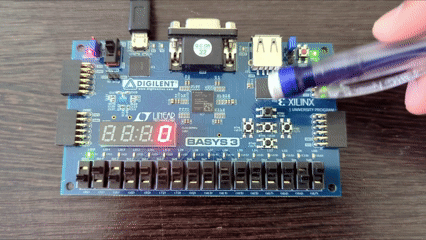
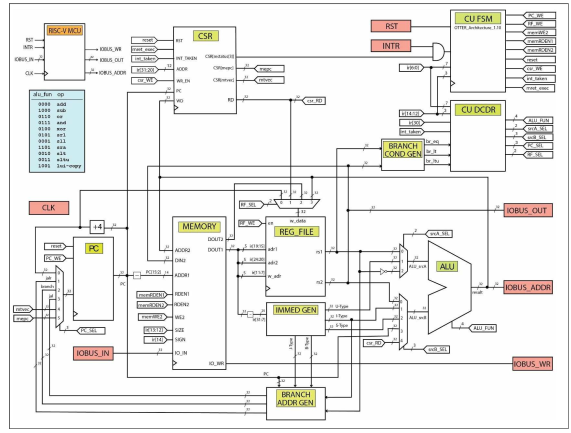
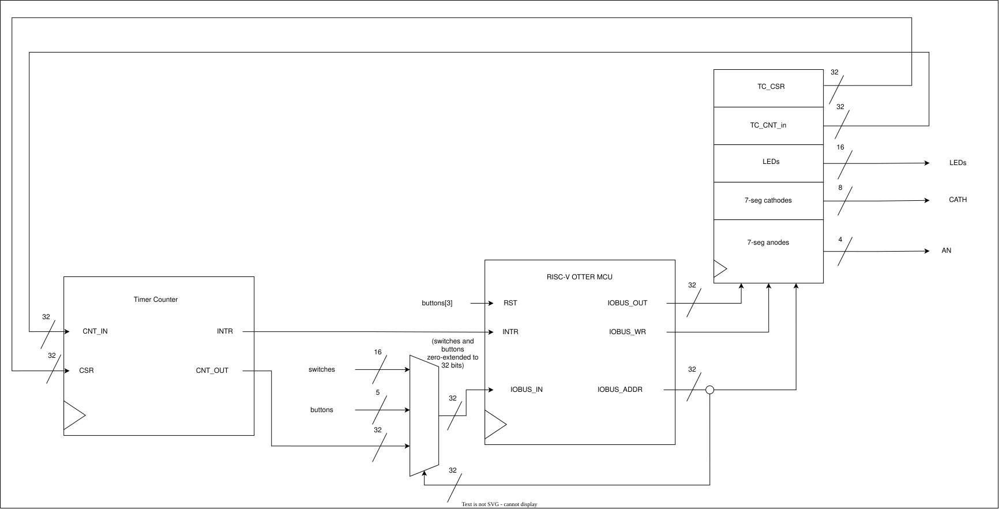
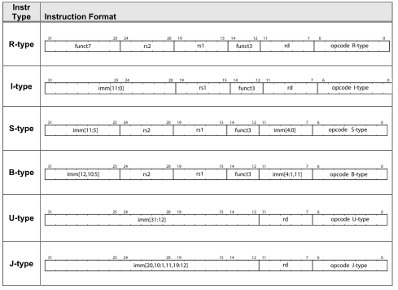
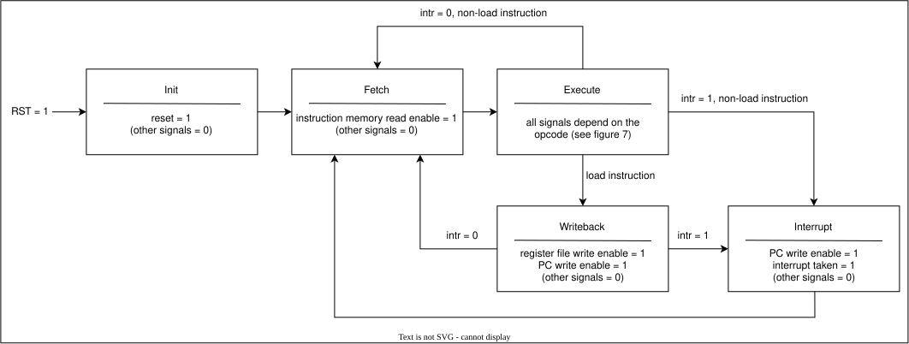
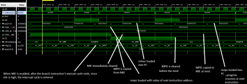

# RISC-V OTTER CPU — RTL Design and FPGA Implementation

This is a 32-bit multicycle RISC-V OTTER CPU implemented in Verilog/SystemVerilog, verified with Vivado simulations, and deployed to a Digilent Basys 3 FPGA board. The completed processor executes RISC-V assembly firmware and supports arithmetic/logic operations, loads and stores, branches and jumps, CSR-based interrupt handling, and timer-counter-based interrupts.

**Technologies:** Verilog/SystemVerilog · RISC-V Assembly · RARS-OTTER · AMD Vivado · Digilent Basys 3 FPGA

<p align="center">
  <br>
  <em>
    Figure 1: Final OTTER demonstration running on a Basys 3 FPGA. The firmware reads buttons and switches, controls LEDs, maintains a two-digit count, and uses timer-generated interrupts to multiplex the 7-segment display. View the full unedited demonstration
    <a href="media/DemonstrationVideoFullUnedited.mp4">here</a>.
  </em>
</p>

---

## Table of Contents

- [Project Overview](#project-overview)
- [My Contributions](#my-contributions)
- [Architecture Overview](#architecture-overview)
- [Implementation Details](#implementation-details)
- [Control Logic](#control-logic)
- [Supported Instructions](#supported-instructions)
- [Interrupt Support](#interrupt-support)
- [Timer-Counter Integration](#timer-counter-integration)
- [Basys 3 Firmware Demonstration](#basys-3-firmware-demonstration)
- [Verification](#verification)
- [Repository Contents](#repository-contents)
- [Acknowledgments and References](#acknowledgments-and-references)

---

## Project Overview

This GitHub repository documents my implementation of the RISC-V OTTER CPU architecture used in Cal Poly's CPE 233: Computer Design and Assembly Language Programming from Winter 2026 as taught by Professor James Mealy. The overall processor architecture was provided by the course. Across a sequence of projects, I implemented and tested major datapath components, completed and extended the processor's control logic from starter templates, integrated the complete multicycle CPU, and later added the required hardware support for interrupts and a timer-counter peripheral.

The processor uses a 32-bit multicycle architecture and implements the RISC-V base integer instruction set, along with CSR/system instructions used for interrupt handling. Most instructions execute using a fetch cycle followed by an execute cycle, while load instructions require an additional writeback cycle.

The completed implementation supports arithmetic and logical operations, shifts and comparisons, byte/halfword/word loads and stores, conditional branches, `jal`/`jalr`, upper-immediate operations, CSR access, and interrupt entry/return.

I verified the design progressively in Vivado using simulation-generated timing diagram waveforms and by synthesizing and implementing the CPU on a Basys 3 FPGA to execute various assembly programs. RISC-V assembly firmware running on the processor interacts with the board through the memory-mapped I/O interface.

---

## My Contributions

The project combines RTL that I designed, course starter templates that I completed and/or extended, and prebuilt modules supplied as infrastructure.

| Area | Starting Point | My Work |
| --- | --- | --- |
| OTTER architecture | High-level circuit diagram (see Figure 3) | Implemented and progressively integrated the architecture in Verilog/SystemVerilog |
| Program Counter | Functional requirements | Designed and implemented the PC and next-PC logic |
| ALU | Functional requirements | Designed and implemented the 32-bit ALU based on operation descriptions in the assembler manual|
| Immediate Generator | Functional requirements | Implemented extraction and extension of RISC-V immediate formats based on their descriptions in the assembler manual|
| Branch Address Generator | Functional requirements | Implemented branch, `jal`, and `jalr` target generation based on relevant descriptions in the assembler manual|
| Branch Condition Generator | Functional requirements | Implemented equality and signed/unsigned comparison logic for conditional branches |
| Control Units FSM / Decoder | Course starter templates | Completed and extended control logic for the supported instruction set and interrupt behavior |
| Register File / Memory | Course-provided modules | Integrated into the processor datapath |
| CSR Module | Course-provided module | Integrated with the CPU and modified the surrounding datapath/control logic to support interrupts |
| Timer-Counter | Course-provided peripheral | Integrated with the FPGA system on the wrapper level and used as an interrupt source |
| Basys 3 MMIO Wrapper | Course starter template | Completed and modified memory mappings to buttons, switches, LEDs, and 7-segment display and implemented connections to the CPU and timer-counter|
| Firmware | Assignment specifications | Designed and coded assembly test programs and final demonstration firmware |
| Verification | — | Simulated individual modules and the complete CPU in Vivado and validated the completed design on the Basys 3 (see Figure 1)|

*Figure 2: Summary of my contributions and course-provided components*

---

## Architecture Overview

### CPU Architecture
<p align="center">
  <a href="media/RISC-V_OTTER_MCU_Architecture_Diagram.svg">
    
  </a><br>
  <em>Figure 3: Circuit schematic for the RISC-V OTTER CPU from James Mealy's <ins>FreeRange Computer Design: The RISC-V OTTER MCU, v14.02</ins></em>
</p>

The processor consists of a datapath controlled by two control units:

- **Program Counter (PC):** stores the address of the current instruction and selects the next address
- **MEMORY:** stores program instructions and data and connects the CPU to memory-mapped I/O
- **Register File (REG_FILE):** contains 32 32-bit registers and provides two source operands and one destination write port
- **Immediate Generator (IMMED_GEN):** extracts and extends immediate fields from the current instruction
- **Branch Address Generator (BRANCH_ADDR_GEN):** calculates branch, `jal`, and `jalr` targets
- **Branch Condition Generator (BRANCH_COND_GEN):** compares register operands for conditional branches
- **Arithmetic Logic Unit (ALU):** performs arithmetic, logical, shift, comparison, and address calculations
- **Control Unit FSM (CU_FSM):** sequences the CPU through instruction-execution cycles and generates control signals primarily based on both the current state and instruction
- **Control Unit Decoder (CU_DCDR):** generates control signals primarily based on the current instruction independent of the current state
- **Control and Status Register module (CSR):** stores interrupt-related CSRs and updates saved PC and interrupt-enable state during interrupt entry and return

### Multicycle Execution

The OTTER uses a multicycle execution model.

Most instructions use two primary cycles: fetch, where the PC provides the instruction address and the CPU reads the next instruction from memory, and execute, where the processor decodes the instruction and performs the required datapath operation. Most arithmetic, logical, branch, jump, and store instructions complete during the execute cycle.

Load instructions require a third writeback cycle. The execute cycle calculates the memory address and initiates the read; the following cycle writes the returned data into the destination register.

There is also an interrupt cycle used to save the current state (to return to after handling the interrupt) and redirect execution to the interrupt service routine (ISR).

Additionally, when the reset signal is asserted, the CPU enters an init cycle before entering the normal instruction cycle.

### Program Counter Sources

The next value loaded into the PC depends on the current instruction and processor state.

Possible sources include:

- `PC + 4` for normal sequential execution
- `branch` for conditional branch targets
- `jal` target for PC-relative jumps
- `jalr` target for register-based jumps
- `mtvec` when entering an ISR
- `mepc` when returning from an interrupt

The branch and jump targets are generated from the current PC value, register operands, and immediate fields encoded in the instruction.

### Control

Processor control is divided between `CU_FSM` and `CU_DCDR`.

`CU_FSM` is state-based. It sequences the CPU through init, fetch, execute, writeback, and interrupt behavior and produces signals controlling when stateful components may change (mostly write and read enables as well as other single-cycle signals), including the PC, register file, memory, and CSR module.

`CU_DCDR` is instruction-based combinational logic. It decodes the opcode and function fields of the current instruction, along with relevant branch and interrupt conditions, to select ALU operation, ALU source operands, next-PC source, and register file writeback source.

Together, the two units determine both the operation that the datapath performs and when the processor state is updated.

### Memory and I/O Architecture

The OTTER uses a Von Neumann architecture with a 32-bit address space. Program code, data, stack, and memory-mapped I/O occupy regions of the same address space.

The course implementation provides 64KiB of physical memory for code, data, and stack, while peripheral devices occupy a separate memory-mapped I/O region; in total, the 32-bit address space spans 4 GiB.

Because I/O is memory-mapped, software can communicate with peripherals using the same load and store instructions used for normal memory accesses.

### FPGA System Integration

<p align="center">
  <a href="media/WrapperDiagram.svg">
    
  </a><br>
  <em>Figure 4: Wrapper-level integration of the OTTER CPU, timer-counter interrupt source, and Basys 3 peripherals as in the demonstration in Figure 1</em>
</p>

The CPU interfaces with the Basys 3 through a course-provided memory-mapped I/O wrapper.

The wrapper connects the OTTER CPU to the Basys 3 peripherals and timer-counter through memory-mapped I/O. It exposes:

- switches and buttons as CPU-readable inputs
- LEDs as CPU-controlled outputs
- 7-segment cathode and anode controls
- timer-counter configuration and count registers

The timer-counter can generate an interrupt connected to the CPU's interrupt input, allowing firmware to schedule periodic work without continuously polling the timer or using a blocking delay.

---

## Implementation Details

### Program Counter and Control Flow

The program counter stores the address of the instruction currently being executed and loads its next value through a multiplexer (MUX).

During normal sequential execution:

```text
PC_next = PC + 4
```
(because the memory is byte-addressable, there are 4 bytes in a word, and each instruction is one word of memory space, so PC + 4 goes to the next instruction).

Control-flow instructions can redirect execution instead.

The branch-address logic calculates:

```text
branch = PC + B-immediate
jal    = PC + J-immediate
jalr   = rs1 + I-immediate
```

The branch-condition logic independently evaluates equality, signed less-than, and unsigned less-than comparisons between the source registers `rs1` and `rs2`. The control decoder combines these results with the current branch instruction to determine whether the PC should be redirected.

### Immediate Generation

RISC-V distributes immediate bits differently across its instruction formats (I, S, B, U, and J), as is detailed in Figure 5 below. The immediate generator reconstructs the immediate value required by each instruction and extends it to 32 bits.

<p align="center">
  <a href="media/RISC-V_Instruction_types_formats.svg">
    
  </a><br>
  <em>Figure 5: RISC-V Instruction Types and Associated Instruction Formats from James Mealy and Paul Hummel's <ins>The RISC-V MCU Assembly Language Manual, v5.06 </ins></em>
</p>

These values are used for immediate arithmetic operations, memory addressing, branches, jumps, and upper-immediate instructions.

### Arithmetic Logic Unit (ALU)

The 32-bit ALU implements the operations required by the supported instruction set, including:

- addition and subtraction
- bitwise AND, OR, and XOR
- logical left/right shifts
- arithmetic right shift
- signed comparison
- unsigned comparison

The ALU inputs are selected by MUXes controlled by the decoder control unit, allowing operations to use different combinations of register values, immediate values, PC-related values, and CSR data.

### Register File and Writeback

The course-provided register file contains 32 32-bit registers.

Two registers can be read as instruction operands (`rs1` and `rs2`), while instruction results can be written into destination register `rd`.

Depending on the instruction, the register-file writeback path selects data from `PC + 4`, CSR read data, data read from memory, or the ALU result.

Notable registers include:
- `x0` or `zero`, which is architecturally fixed to zero
- `x1` or `ra`, which conventionally stores return addresses
- `x2` or `sp`, which conventionally holds the stack pointer
- `x6` or `t1`, a temporary register that may be overwritten by the `call` pseudoinstruction when constructing the jump target

### Memory Access

Instruction fetches use the PC as the program-memory address.

Loads and stores calculate their effective address using:

```text
effective_address = rs1 + sign-extended immediate
```

The implementation supports byte, halfword, and word memory operations, including signed and unsigned loads.

The same memory-access mechanism also allows software to communicate with memory-mapped peripherals.

---

## Control Logic

### FSM

<p align="center">
  <a href="media/FSMStateDiagram.svg">
    
  </a><br>
  <em>Figure 6: RISC-V OTTER FSM state diagram</em>
</p>


During the Execute state, the FSM asserts different control signals and selects the next state based on the current instruction type. Signals not shown as asserted are `0`.

| Instruction Type | `PC_WE` (PC write enable) | `RF_WE` (RF write enable) | `memWE2` (Data memory write enable) | `memRDEN2` (Data memory read enable) | `csr_WE` (CSR write enable) | `mret_exec` (MCU executing `mret` instruction) | Next State (`intr = 0`) | Next State (`intr = 1`) |
| --- | :---: | :---: | :---: | :---: | :---: | :---: | --- | --- |
| `LOAD` | 0 | 0 | 0 | 1 | 0 | 0 | `st_WB` | `st_WB` |
| `STORE` | 1 | 0 | 1 | 0 | 0 | 0 | `st_FET` | `st_INTR` |
| `BRANCH` | 1 | 0 | 0 | 0 | 0 | 0 | `st_FET` | `st_INTR` |
| `LUI` | 1 | 1 | 0 | 0 | 0 | 0 | `st_FET` | `st_INTR` |
| `AUIPC` | 1 | 1 | 0 | 0 | 0 | 0 | `st_FET` | `st_INTR` |
| `OP_IMM` | 1 | 1 | 0 | 0 | 0 | 0 | `st_FET` | `st_INTR` |
| `OP_RG3` | 1 | 1 | 0 | 0 | 0 | 0 | `st_FET` | `st_INTR` |
| `JAL` | 1 | 1 | 0 | 0 | 0 | 0 | `st_FET` | `st_INTR` |
| `JALR` | 1 | 1 | 0 | 0 | 0 | 0 | `st_FET` | `st_INTR` |
| `CSRRW` | 1 | 1 | 0 | 0 | 1 | 0 | `st_FET` | `st_INTR` |
| `CSRRC` | 1 | 1 | 0 | 0 | 1 | 0 | `st_FET` | `st_INTR` |
| `CSRRS` | 1 | 1 | 0 | 0 | 1 | 0 | `st_FET` | `st_INTR` |
| `MRET` | 1 | 0 | 0 | 0 | 1 | 1 | `st_FET` | `st_INTR` |

*Figure 7: FSM control signals and next-state behavior during the execute state*

The processor control system consists of `CU_FSM` and `CU_DCDR`. Both began from course-provided starter templates that I completed and extended.

The interrupt-enabled FSM contains the following states, whose asserted signals are detailed in Figures 6 and 7:
- initialization: synchronously resets the program counter and interrupt-related CSRs
- fetch: reads the instruction at the current PC
- execute: decodes and carries out the current instruction
- writeback: writes loaded memory data into the destination register
- interrupt: saves the return state and redirects execution to the interrupt handler

### Decoder

The control-unit decoder selects datapath operations and data sources based on the current instruction. For branches, the selected next-PC source also depends on the branch-condition results.

| Instruction Type | `ALU_FUN` | `srcA_SEL` | `srcB_SEL` | `RF_SEL` | `PC_SEL` |
| --- | --- | --- | --- | --- | --- |
| `LUI` | Pass source A / LUI | U-type immediate | irrelevant | ALU result | `PC + 4` |
| `AUIPC` | Add | U-type immediate | PC | ALU result | `PC + 4` |
| `JAL` | irrelevant | irrelevant | irrelevant | `PC + 4` | `jal` target |
| `JALR` | irrelevant | irrelevant | irrelevant | `PC + 4` | `jalr` target |
| `BRANCH` | irrelevant | irrelevant | irrelevant | `PC + 4` | Branch target if condition is met; otherwise `PC + 4` |
| `LOAD` | Add | `rs1` | I-type immediate | Memory data | `PC + 4` |
| `STORE` | Add | `rs1` | S-type immediate | irrelevant | `PC + 4` |
| `OP_IMM` | Determined by `func3` / `func7` | `rs1` | I-type immediate | ALU result | `PC + 4` |
| `OP_RG3` | Determined by `func3` / `func7` | `rs1` | `rs2` | ALU result | `PC + 4` |
| `CSRRW` | Pass `rs1` / LUI | `rs1` | irrelevant | CSR read data | `PC + 4` |
| `CSRRC` | AND | `~rs1` | CSR data | CSR read data | `PC + 4` |
| `CSRRS` | OR | `rs1` | CSR data | CSR read data | `PC + 4` |
| `MRET` | irrelevant | irrelevant | irrelevant | irrelevant | `mepc` |
| Interrupt taken | irrelevant | irrelevant | irrelevant | irrelevant | `mtvec` |

*Figure 8: Control-unit decoder outputs for each supported instruction type.*

The decoder interprets the current instruction and selects the ALU function, ALU operand sources, register-file writeback source, and next-PC source. For conditional branches, it also uses the comparison results generated by the branch condition generator. Some outputs are irrelevant for instructions that do not use the corresponding datapath path.

---

## Supported Instructions

The processor supports the following RISC-V instructions:

### Arithmetic and Logic

`add` · `addi` · `sub` · `and` · `andi` · `or` · `ori` · `xor` · `xori`

### Shifts and Comparisons

`sll` · `slli` · `srl` · `srli` · `sra` · `srai` · `slt` · `slti` · `sltu` · `sltiu`

### Loads and Stores

`lb` · `lbu` · `lh` · `lhu` · `lw` · `sb` · `sh` · `sw`

### Branches and Jumps

`beq` · `bne` · `blt` · `bltu` · `bge` · `bgeu` · `jal` · `jalr`

### Upper-Immediate Operations

`lui` · `auipc`

### CSR and System Instructions

`csrrw` · `csrrs` · `csrrc` · `mret`

The assembler also supports pseudoinstructions such as `li`, `la`, `mv`, `j`, `ret`, `call`, and `csrw`. These are assembler conveniences that expand into one or more underlying machine instructions rather than requiring separate hardware implementations.

---

## Interrupt Support

The OTTER uses a course-provided CSR module together with modifications to the processor datapath and control system.

The primary interrupt-related CSRs are the following 32-bit registers:

- `mstatus`: stores interrupt enable/state information, particularly in the bits `MIE` and `MPIE`
    - `MIE` (Machine Interrupt Enable) controls whether interrupts are enabled, while `MPIE` (Machine Previous Interrupt Enable) temporarily stores the previous value of `MIE` during an interrupt.
- `mtvec`: stores the ISR address
- `mepc`: stores the PC value used to resume execution after the ISR

The processor supports the CSR/system instructions:

- `csrrw`: reads a CSR into `rd` (destination register) and writes `rs1` (source register 1) into that CSR
- `csrrs`: reads a CSR into `rd` and sets the CSR bits that are 1 in `rs1`
- `csrrc`: reads a CSR into `rd` and clears the CSR bits that are 1 in `rs1`
- `mret`: returns from an interrupt by restoring execution from `mepc`

To add interrupts, I instantiated the CSR module, extended the FSM and decoder, expanded the PC-selection path to include `mtvec` and `mepc`, added CSR operations to the ALU operand-selection paths, and integrated the required interrupt-control connections.

### Interrupt Flow

1. Firmware writes the ISR address to `mtvec`.
2. Firmware enables interrupts through `mstatus`.
3. An interrupt request reaches the CPU.
4. The processor completes the current instruction.
5. The FSM enters the interrupt state.
6. The return address is saved in `mepc`.
7. The PC is redirected to the address stored in `mtvec`.
8. The current interrupt-enable bit (`MIE`) is copied to `MPIE`, then `MIE` is cleared to prevent nested interrupts while the ISR runs.
9. The ISR executes.
10. `mret` restores execution by loading the return address stored in `mepc` into the PC.
11. `MPIE` is copied back to `MIE`, restoring the previous interrupt-enable state.

---

## Timer-Counter Integration

The final system uses a course-provided timer-counter peripheral as an interrupt source.

Firmware accesses the peripheral through the memory-mapped I/O interface and configures its control and count registers.

Once enabled, the timer counts clock events and generates an interrupt when the programmed count is reached.

For the final demonstration, I configured the timer to generate interrupts at approximately 200 Hz with no additional prescaling. With the clock configuration used in the project, this corresponded to a timer count of 249,999.

These periodic interrupts drive the 7-segment display multiplexing routine.

---

## Basys 3 Firmware Demonstration

To view the demo, see Figure 1 or click [here](media/DemonstrationVideoFullUnedited.mp4) for the full, unedited video.

The final demonstration program combines foreground polling, memory-mapped I/O, software debouncing, and timer-generated interrupts. The foreground code handles button polling and debouncing, switch input, count updates, and LED movement, while the ISR handles the 7-segment display multiplexing. See the full assembly code [here](DemonstrationAssemblyProgramSwitchCounter.s).

### Foreground Behavior

The main program:

1. Polls the pushbutton until a press is detected
2. Debounces the button in software
3. Reads the switch corresponding to the currently illuminated LED
4. Increments a two-digit count if the switch beneath the LED is on; rolls the count from `99` to `00` as needed
5. Moves the active LED one position to the right; wraps the active LED back to the leftmost position after the final LED
6. Waits for and debounces the button release before accepting another press

The active LED therefore indicates which switch will be evaluated on the next valid button press.

### Timer-Driven ISR

The two rightmost 7-segment digits display the current count.

Instead of using a blocking delay loop to multiplex the display, the timer-counter periodically interrupts the CPU.

The ISR:

1. Turns off 7-segment anodes (to prevent ghosting when switching digits)
2. Determines which digit should currently be active
3. Selects the corresponding decimal value
4. Looks up the required 7-segment pattern
5. Writes the segment and anode outputs
6. Alternates to the other digit for the next interrupt
7. Returns to the foreground program using `mret`

---

## Verification

I verified the processor progressively in Vivado, beginning with individual datapath modules and progressing to simulations of the integrated CPU running custom RISC-V assembly programs. Module-level testing verified the PC, ALU, immediate generation, branch/jump address generation, and branch-condition logic, while processor-level simulations verified instruction execution, control flow, CSR operations, interrupt handling, and all supported instructions producing expected results.

### Interrupt Verification

The waveform below shows a complete interrupt entry and return sequence:

<p align="center">
  <a href="media/InterruptVerificationSimWaveform.svg">
    
  </a><br>
  <em>Figure 9: Annotated Vivado simulation of interrupt entry and return</em>
</p>

The waveform verifies that `MIE` is copied to `MPIE` and cleared when the interrupt is taken, the return PC is saved in `mepc`, and execution is redirected through `mtvec`. When `mret` executes, the PC returns to `mepc` and the previous interrupt-enable state is restored.

Other portions of the interrupt verification simulation verified processor initialization, repeated interrupts, normal execution without interrupts, and the individual datapath modules.

---

## Repository Contents

```text
.
├── README.md
├── DemonstrationAssemblyProgramSwitchCounter.s
├── RISCV_OTTER_MCU.xpr
├── constraints_file_Basys3_Master_v1_03.xdc
├── demonstrationProgram.mem
├── rtl/
│   ├── ALU.v
│   ├── CSR_v1_05.sv
│   ├── CU_DCDR.sv
│   ├── CU_FSM.sv
│   ├── Otter_wrapper_TC_driver_v1_01.sv
│   ├── RISCV_OTTER_MCU.v
│   ├── mux_4t1_nb_v1_06.v
│   ├── mux_8t1_nb_v1_03.v
│   ├── otter_memory_v1_06.sv
│   ├── reg_file_v1_02.sv
│   ├── reg_nb_synch_clr.v
│   └── timer_counter.sv
└── media/
    ├── DemonstrationVideoFullUnedited.mp4
    ├── FSMStateDiagram.svg
    ├── InterruptVerificationSimWaveform.svg
    ├── RISC-V_Instruction_types_formats.svg
    ├── RISC-V_OTTER_MCU_Architecture_Diagram.svg
    ├── ShortenedDemonstrationVideo.gif
    └── WrapperDiagram.svg
```

---

## Acknowledgments and References

This project was completed in CPE 233: Computer Design and Assembly Language Programming at California Polytechnic State University, San Luis Obispo, taught by Professor James Mealy.

The overall RISC-V OTTER architecture and several supporting modules or starter templates were provided through the course. These include the register file and memory modules, CSR module, timer-counter peripheral, and starter code for portions of the control logic and FPGA wrapper. Original authorship and revision headers are preserved in course-provided source files.

### Reference Materials

- James Mealy, *FreeRange Computer Design: The RISC-V OTTER MCU*, v14.02
- James Mealy, *CPE 233 RISC-V OTTER MCU Lab Activity Manual*, v14.06
- James Mealy and Paul Hummel, *The RISC-V MCU Assembly Language Manual*, v5.06

Figures reproduced or adapted from course materials are attributed individually in their captions.
